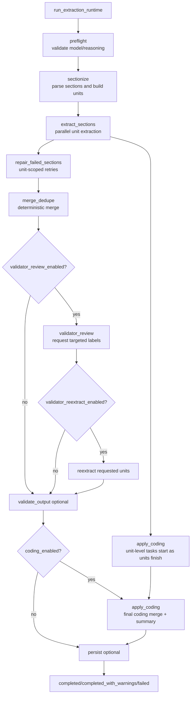

# Finding Extractor Internals

Architecture notes for contributors working on the extraction runtime.

## Module Map

| File | Role |
|---|---|
| `src/finding_extractor/extraction_runtime.py` | Shared entrypoint for worker/CLI/batch/eval; preflight, orchestrator wiring, reliability policy, optional persistence |
| `src/finding_extractor/extraction_orchestrator.py` | V2 chunk-scoped orchestration (`sectionize -> extract_sections -> repair_failed_sections -> merge_dedupe -> validator_review -> validate_output -> apply_coding`) with pipelined unit-level coding |
| `src/finding_extractor/extraction_agent.py` | Single-unit extraction agent (`extract_findings`), prompt assembly, output-level verbatim retry |
| `src/finding_extractor/semantic_chunking.py` | Findings/impression chunking policy (sentence-first, semantic grouping, impression list chunking) |
| `src/finding_extractor/impression_list_chunker.py` | Chonkie `BaseChunker` for deterministic impression list-item grouping |
| `src/finding_extractor/report_sections.py` | Deterministic section parsing for radiology reports |
| `src/finding_extractor/coding_bridge.py` | Deterministic coding plus optional LLM adjudication for ambiguous candidates |
| `src/finding_extractor/extraction_review.py` | Optional validator review pass requesting targeted unit re-extraction |
| `src/finding_extractor/tasks.py` | Worker lifecycle and job-state transitions, delegates execution to `run_extraction_runtime()` |

## Runtime Entry Surfaces

All extraction surfaces use the same runtime function:

1. worker task (`tasks.py`)
2. CLI (`cli.py`)
3. batch CLI (`batch_cli.py`)
4. eval task adapter (`eval/task.py`)

## Extraction Flow

## Stage Status Contract

Stage messages are emitted as:

`[stage:<stage_name>] <detail>`

Canonical stage names:

1. `preflight`
2. `sectionize`
3. `extract_sections`
4. `repair_failed_sections`
5. `merge_dedupe`
6. `validator_review`
7. `validate_output`
8. `apply_coding`
9. `persist`
10. `completed`
11. `completed_with_warnings`
12. `failed`

## Chunk Unit Contract

Each extraction unit includes:

1. `section_name` (`findings` or `impression`)
2. target chunk text (extractable evidence)
3. preceding half-chunk context (advisory)
4. following half-chunk context (advisory)

Prompt guidance explicitly constrains extraction evidence to the target chunk.

## Chunking Policy

1. deterministic report section splitting runs first
2. only `findings` and `impression` are chunked
3. sections below sentence threshold are passthrough (single unit)
4. impression list structure is chunked deterministically via `ImpressionListChunker`
5. otherwise semantic grouping is applied, with sentence-group fallback on semantic failure
6. section headings are stripped from chunk payloads

See `docs/semantic-chunking-plan.md` for policy details.

## Validator Review Controls

Validator review is controlled by:

1. `validator_review_enabled` (`IPL_VALIDATOR_REVIEW_ENABLED`)
2. `validator_model` (`IPL_VALIDATOR_MODEL`, optional override)
3. `validator_reasoning` (`IPL_VALIDATOR_REASONING`)
4. `validator_reextract_enabled` (`IPL_VALIDATOR_REEXTRACT_ENABLED`)

If `validator_model` is unset, the extraction model is used.
`validator_reextract_enabled` only gates re-execution of requested units. Review still runs when `validator_review_enabled=true`.

## Coding Controls

Coding is optional and non-fatal for extraction completion.

1. deterministic lookup/search runs first
2. ambiguous candidates may use small LLM adjudicators
3. unit-level coding tasks are scheduled as extraction units complete (pipelined)
4. final coding merge aligns to merged finding order at end of orchestration
5. coding index calls are guarded by shared locks to preserve safety with shared DuckDB/index cache internals
6. coding failures are logged and extraction still completes

## Status Callback Wiring

`run_extraction_runtime()` accepts a pluggable async status callback.

1. worker passes DB writer callback (`update_job_status_message`)
2. CLI passes stderr callback
3. batch/eval can omit callback for silent runs

This keeps one runtime path while allowing different output sinks.

## Reliability Contract

Runtime applies strict/lenient behavior using warning payloads:

1. strict mode raises on validation failures or unrecovered failed units
2. lenient mode completes with warning payload when applicable
3. terminal statuses remain machine-parseable (`completed`, `completed_with_warnings`, `failed`)

## Testing Pointers

Primary coverage for runtime and orchestration behavior:

1. `tests/test_extraction_orchestrator.py`
2. `tests/test_semantic_chunking.py`
3. `tests/test_impression_list_chunker.py`
4. `tests/test_extraction_runtime.py`
5. `tests/test_tasks.py`
