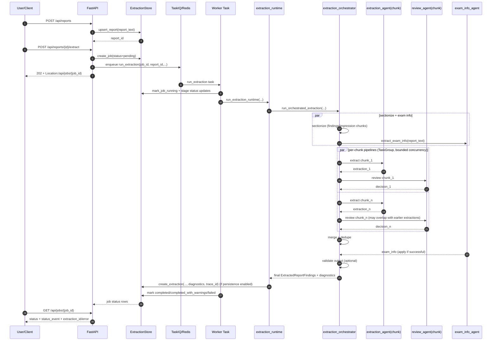

# Finding Extractor Internals

Architecture notes for contributors working on the extraction runtime.

Last verified against code: 2026-03-16

## Module Map

| File | Role |
|---|---|
| `src/finding_extractor/extractor/runtime.py` | Shared entrypoint for worker/CLI/batch/eval; preflight, orchestrator wiring, reliability policy, optional persistence |
| `src/finding_extractor/extractor/orchestrator/__init__.py` | Public orchestration facade and import surface |
| `src/finding_extractor/extractor/orchestrator/run.py` | Top-level workflow coordinator |
| `src/finding_extractor/extractor/orchestrator/types.py` | Orchestration result/review types shared across orchestrator internals |
| `src/finding_extractor/extractor/orchestrator/chunks.py` | Section chunk construction, semantic expansion, and per-chunk extraction execution |
| `src/finding_extractor/extractor/orchestrator/merge.py` | Merge, dedupe, usage aggregation, and failed-chunk metadata helpers |
| `src/finding_extractor/extractor/orchestrator/review.py` | Per-chunk review and feedback-building helpers |
| `src/finding_extractor/extractor/agent.py` | Chunk sub-agent (`extract_chunk_findings` / `extract_chunk`) with dedicated chunk prompt/schema; legacy full-report helper retained for non-runtime tests |
| `src/finding_extractor/extractor/chunking.py` | Findings/impression chunking policy (sentence-first, semantic grouping, impression list chunking) |
| `src/finding_extractor/extractor/impression_chunker.py` | Chonkie `BaseChunker` for deterministic impression list-item grouping |
| `src/finding_extractor/extractor/report_sections.py` | Deterministic section parsing for radiology reports, including implicit findings inference |
| `src/finding_extractor/extractor/exam_info_agent.py` | Dedicated sub-agent for extracting exam metadata (study_date, modality, body_region, body_part, contrast, laterality) |
| `src/finding_extractor/extractor/review.py` | Validator review pass requesting targeted chunk re-extraction with feedback |
| `src/finding_extractor/extractor/progress.py` | Stage-progress callback typing and `[stage:...]` formatting helpers |
| `src/finding_extractor/worker/extraction_jobs.py` | Worker lifecycle and job-state transitions, delegates execution to `run_extraction_runtime()` |
| `src/finding_extractor/core/observability.py` | Logfire instrumentation setup, `observation_span()` for pipeline-level tracing, `get_current_trace_id()` for OTel trace capture |

## Canonical Runtime Contract

All extraction surfaces call the same runtime path:

1. worker task (`worker/extraction_jobs.py`)
2. CLI (`cli/extract.py`)
3. batch CLI (`cli/batch.py`)
4. eval task adapter (`eval/task.py`)

That shared path is `run_extraction_runtime()`, which always calls `run_orchestrated_extraction()`.

`extractor.orchestrator` is intentionally thin: `orchestrator/__init__.py` is the public facade, `orchestrator/run.py` coordinates the high-level workflow, and chunk execution, merge/dedupe, and review mechanics live in sibling helper modules.

`run_orchestrated_extraction()` reads as a top-level workflow:

1. Start exam-info extraction concurrently with sectionize
2. Build section chunks (findings + impression)
3. Expand chunks via semantic/list chunking if enabled
4. Run per-chunk pipelines via `TaskGroup` (bounded by global semaphore):
   - Extract chunk
   - Review chunk (awaits shared exam_info result before first review)
   - If reviewer flags issues and re-extract is enabled, correct with feedback
5. Merge successful chunk outputs (dedupe, tag source sections)
6. Apply exam-info to merged extraction (only if dedicated pass succeeded)
7. Validate final extraction
8. Build pipeline diagnostics
9. Return `OrchestrationResult`

PydanticAI handles retries internally (output validation retries + FallbackModel).
There is no application-level chunk repair loop.

## End-to-End Pipeline (Current)

## Stage Status Sequence

The runtime stack emits parseable stage messages as:

`[stage:<stage_name>] <detail>`

Canonical stages and ownership:

1. `preflight` (runtime)
2. `sectionize` (orchestrator)
3. `extract_exam_info` (orchestrator, concurrent with sectionize and chunk work)
4. `extract_sections` (orchestrator, per-chunk extraction within pipeline)
5. `review` (orchestrator, per-chunk review within pipeline — may interleave with `extract_sections`)
6. `merge_dedupe` (orchestrator)
7. `validate_output` (orchestrator)
8. `persist` (runtime, when storage enabled)
9. `completed` (runtime)
10. `completed_with_warnings` (runtime)
11. `failed` (worker task failure path)

With per-chunk pipelines, `extract_sections` and `review` stage messages interleave
temporally — a chunk's review may appear before another chunk's extraction completes.
Each message carries the chunk ID for disambiguation.

Worker callbacks persist these to `jobs.status_message`; API maps them into `status_event`.

## Sectioning and Chunking Behavior

Sectioning:

1. deterministic regex header detection (`findings`, `impression`, `technique`, etc.)
2. supports aliases like `body` -> `findings`, `conclusion` -> `impression`
3. if no explicit findings header exists, infers an implicit findings block immediately before first impression when plausible
4. extraction proceeds only on `findings` and `impression` sections

Chunking:

1. strip leading section heading text from chunk payloads
2. compute sentence spans first
3. if sentence count is below threshold, passthrough as one chunk
4. impression: if list structure exists, chunk deterministically by grouped list items
5. otherwise semantic grouping (Chonkie `SemanticChunker`) with sentence-group fallback on semantic failure
6. enforce max sentences per final chunk (default 3)

### Chunking Configuration

| Setting | Purpose |
|---------|---------|
| `IPL_CHUNKING_SEMANTIC_TRIGGER_SENTENCE_COUNT` | Sentence count below which sections pass through as one chunk |
| `IPL_CHUNKING_IMPRESSION_LIST_CHUNKING_ENABLED` | Enable deterministic list-item chunking for impression sections |
| `IPL_CHUNKING_IMPRESSION_LIST_MAX_ITEMS_PER_CHUNK` | Max list items per impression chunk |
| `IPL_CHUNKING_IMPRESSION_LIST_MIN_ITEMS_PER_CHUNK` | Min list items per impression chunk |
| `IPL_CHUNKING_SEMANTIC_EMBEDDING_MODEL` | Embedding model for semantic similarity |
| `IPL_CHUNKING_SEMANTIC_THRESHOLD` | Similarity threshold for semantic chunk boundaries |
| `IPL_CHUNKING_SEMANTIC_CHUNK_SIZE` | Target chunk size for semantic grouping |
| `IPL_CHUNKING_SEMANTIC_SIMILARITY_WINDOW` | Window size for semantic similarity comparison |
| `IPL_CHUNKING_SEMANTIC_SKIP_WINDOW` | Skip window for semantic chunking |

## Extraction Chunk Contract

Each chunk includes:

1. `section_name` (`findings` or `impression`)
2. target chunk text
3. preceding half-chunk context
4. following half-chunk context

The chunk sub-agent enforces a dedicated `ExtractedChunkFindings` schema and constrains
evidence to target chunk text; adjacent context is advisory.

## Coding

Coding (OIFM finding code and anatomic location code assignment) is a separate, independent tool — not part of the extraction pipeline. See `docs/coding-agent-design.md`.

## Reviewer Contract

Reviewer runs by default in the V2 runtime. Config controls:

1. `IPL_REVIEWER_ENABLED` (default: `true`)
2. `IPL_REVIEWER_MODEL` (optional override; must differ from extraction model)
3. `IPL_REVIEWER_REASONING`
4. `IPL_REVIEWER_REEXTRACT_ENABLED`

When enabled, review produces one `ExtractionReviewDecision` per chunk with:
- `report_chunk_id`: chunk being reviewed
- `should_reextract`: whether that chunk should be re-run
- `problems[]`: reviewer-identified issues (`raw_extracted_finding_index`, `extract_problem_type`, `problem_detail`)
- `rationale`: optional reviewer explanation

Feedback is threaded to retry chunks and appended to the chunk extraction prompt.
Review timeout is non-fatal — pipeline continues without re-extraction.

## Reasoning Compatibility Contract

Runtime resolves reasoning levels for extraction and validator model calls before
any provider request:

1. resolve requested level (explicit -> config default -> provider default)
2. apply known-safe normalization for model-specific incompatibilities
3. fail fast when model-family compatibility cannot be verified

The default behavior is strict fail-fast for unknown model families. This can be
overridden with `IPL_ALLOW_UNKNOWN_MODEL_REASONING=true`.

This runtime-compatible resolver is used consistently in worker/API/CLI batch/eval
preflight paths to avoid entrypoint-specific behavior drift.

## Reliability and Terminal Outcomes

Runtime warning payloads capture validation/verbatim/coverage/section-failure categories.

1. strict mode fails on validation failures or unrecovered section failures
2. lenient mode can complete with warnings
3. terminal statuses are machine-parseable: `completed`, `completed_with_warnings`, `failed`

## Persistence and Observability

Extraction results are persisted to SQLite via `ExtractionStore.create_extraction()`.
Key denormalized fields on `ExtractionRow`:

- **Exam info columns**: `study_description`, `study_date`, `modality`, `body_region`,
  `body_part`, `contrast`, `laterality` — avoids JSON deserialization for summary views.
- **`finding_count`**: computed at persist time from `len(extraction.findings)`.
- **`diagnostics_json`**: serialized `PipelineDiagnostics` (chunk counts, repair stats,
  validator stats). Returned in detail API response.
- **`trace_id`**: OpenTelemetry trace ID captured at persist time via
  `observability.get_current_trace_id()`. When Logfire is enabled, this links the
  stored extraction to its full Logfire trace (exact prompts, responses, timing).
  System prompts are deterministic code constants (versioned by git), so
  trace_id + git commit provides full prompt reproducibility.

## Testing Pointers

Primary coverage for runtime and orchestration behavior:

1. `tests/test_extraction_orchestrator.py`
2. `tests/test_semantic_chunking.py`
3. `tests/test_impression_list_chunker.py`
4. `tests/test_extraction_runtime.py`
5. `tests/test_tasks.py`
6. `tests/test_exam_info_agent.py`
7. `tests/test_extraction_review.py`
