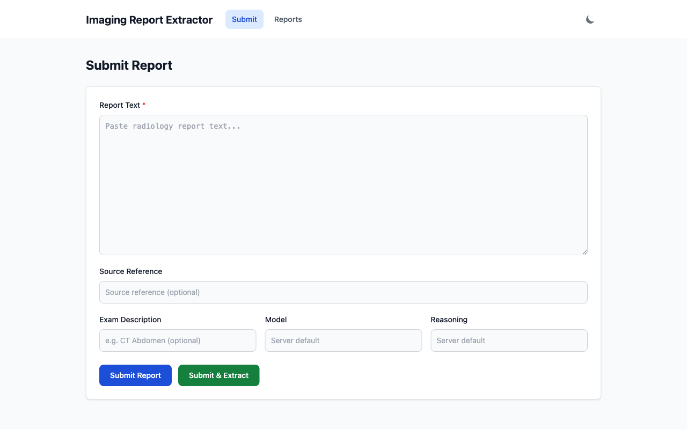
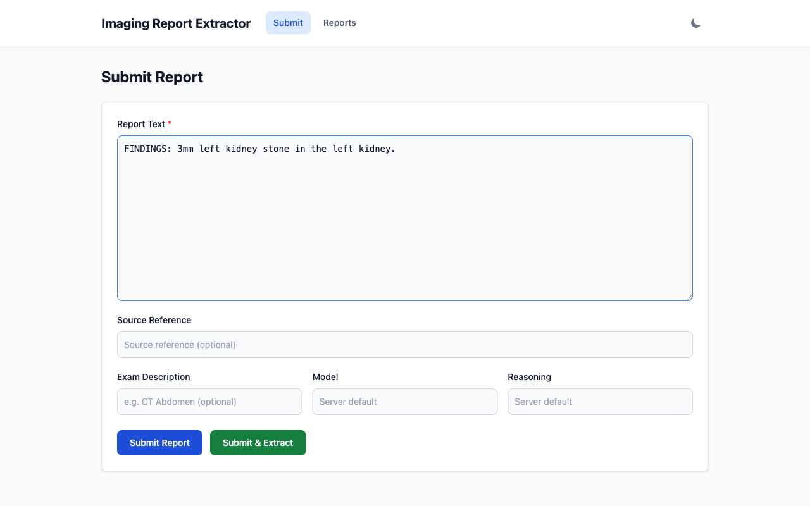
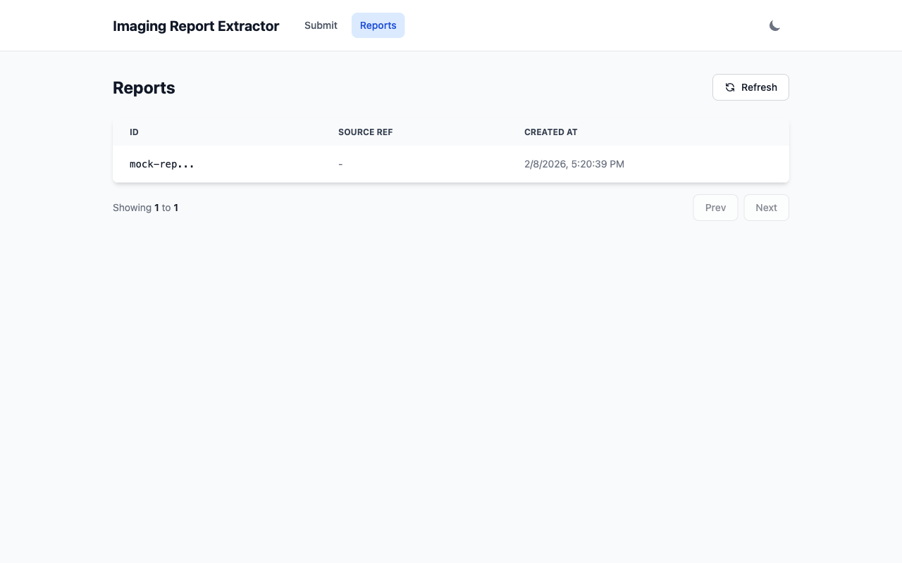
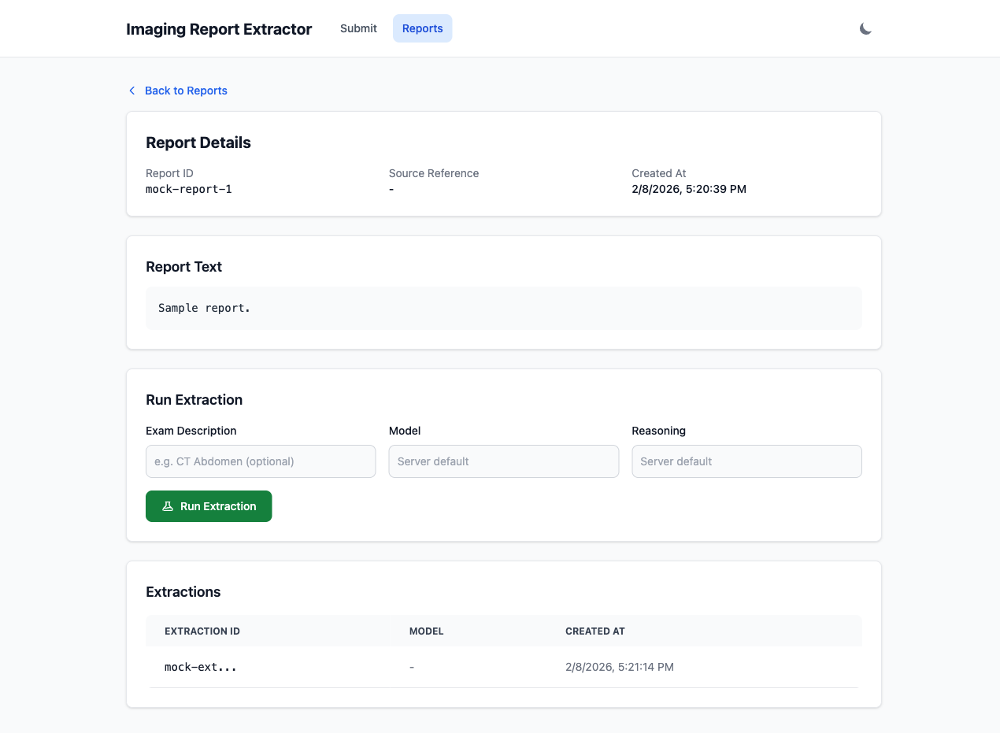
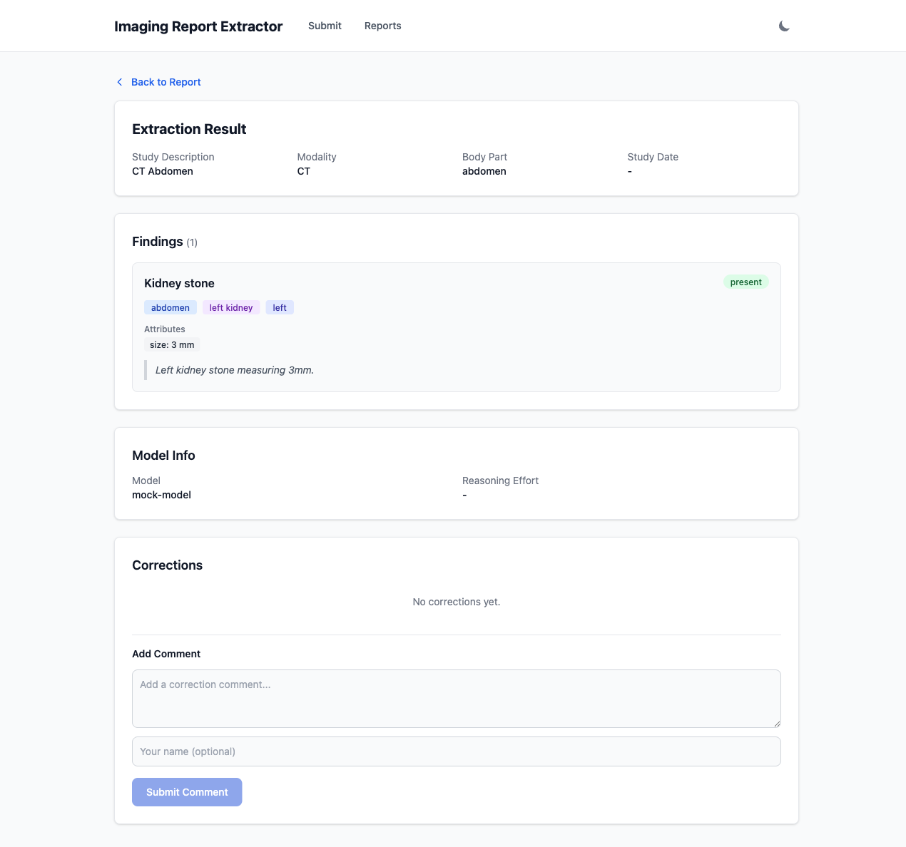

# Extraction Frontend Usage Guide

The extraction frontend is a browser-based UI for submitting radiology reports, triggering finding extraction, and reviewing results.

## Running the Frontend

### Development (no backend needed)

Serve the static files and open in mock mode:

```bash
cd extractor-ui
python3 -m http.server 8000
# Open http://localhost:8000/?mock
```

Mock mode (`?mock` query parameter) uses an in-memory mock API layer so no backend is required. All views are functional with sample data.

### Production

Serve `extractor-ui/` at `/` via nginx and proxy `/api/*` to the FastAPI backend:

```bash
# Start backend
uv run finding-extractor-api

# Configure nginx to serve extractor-ui/ at / and proxy /api to the backend
# Then open http://localhost/ (no ?mock parameter)
```

## Views

### Submit Report

The landing page (`#/`). Paste a radiology report and submit it.



**Fields:**
- **Report Text** (required): The radiology report to analyze.
- **Source Reference** (optional): An external identifier for the report.
- **Exam Description** (optional): A hint like "CT Abdomen" to help the extraction model.
- **Model** (optional): Override the server's default extraction model (e.g., `openai:gpt-4o`).
- **Reasoning** (optional): Override the server's default reasoning effort level.

**Actions:**
- **Submit Report**: Saves the report only. Shows a success message with a link to the report.
- **Submit & Extract**: Saves the report and immediately starts extraction. Navigates to the progress view, then automatically to the extraction result when complete.



### Reports List

Browse previously submitted reports (`#/reports`).



- Click any row to view the report detail.
- Use **Prev/Next** to paginate (20 reports per page).
- Click **Refresh** to reload the current page.

### Report Detail

View a single report and its extraction history (`#/reports/{id}`).



- Shows report text and metadata.
- **Run Extraction** triggers a new extraction with optional model/reasoning overrides.
- The **Extractions** table lists all prior extractions; click a row to view results.

### Extraction Progress

Shown while an extraction job is running (`#/reports/{id}/extracting/{job_id}`). Displays a spinner and polls the backend every 2 seconds. Automatically navigates to the extraction detail when the job completes. If the job fails, shows an error with a retry link.

### Extraction Detail

View the structured extraction results (`#/extractions/{id}`).



Sections:
- **Exam Info**: Study description, modality, body part, study date.
- **Findings**: Each finding shows name, presence badge, location badges, attributes, and the source report text quote.
- **Non-Finding Text**: Categorized text segments that aren't findings (e.g., clinical history, technique).
- **Validation**: Warnings and errors from the output validator, if any.
- **Model Info**: Which model and reasoning level produced the extraction.
- **Corrections**: Comment-based feedback. Add a comment with an optional author name.

## Dark Mode

Toggle with the sun/moon button in the top-right corner. The preference is saved in localStorage and persists across sessions. If no preference is set, it follows the system setting.
