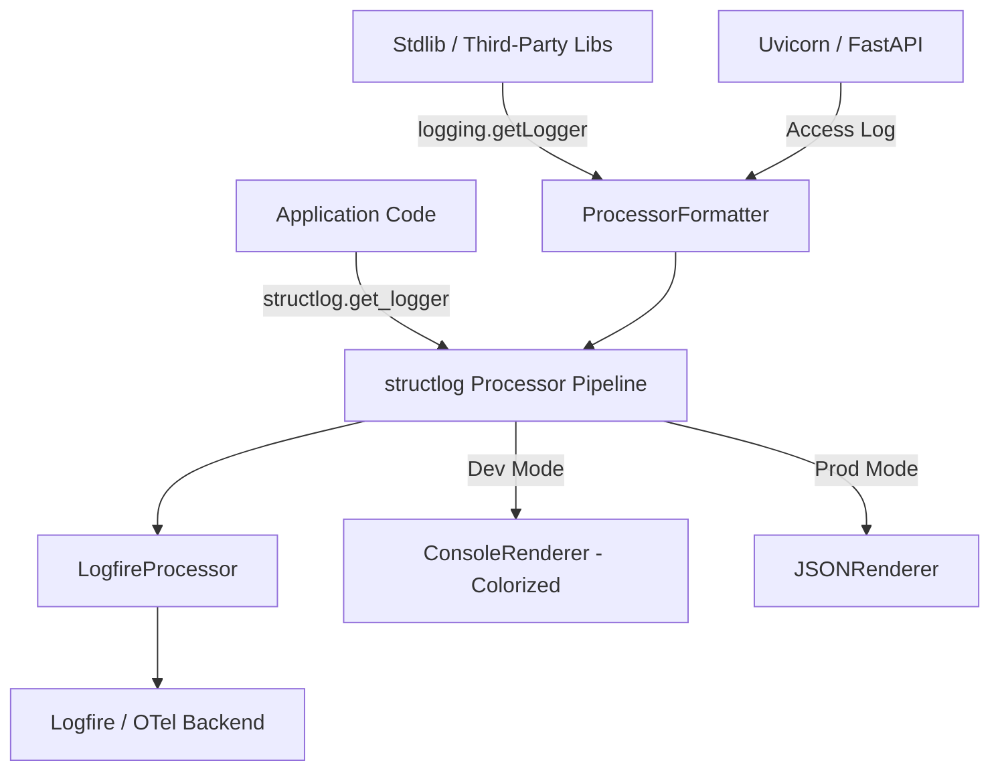

# Unified Logging Architecture Plan

This document outlines the strategy for implementing a consistent, structured logging system across the `finding-extractor` application (API, CLI, and Worker) using [structlog](https://www.structlog.org/).

## 1. Objectives

- **Consistency:** Uniform structured log format across all system components.
- **Simplicity:** Replace boilerplate `logging.getLogger(__name__)` with `structlog.get_logger()`.
- **Observability:** Structured key-value logging with JSON output for production and colorized console output for development, integrated with Logfire via `StructlogProcessor`.
- **Interoperability:** Wrap (not replace) standard library logging so third-party libraries (SQLAlchemy, Uvicorn, httpx) are formatted consistently without interception hacks.
- **Context propagation:** Automatic per-request and per-task context (job ID, request ID) via `structlog.contextvars`, without threading IDs through function signatures.

## 2. Architecture

structlog wraps and enhances stdlib logging rather than replacing it. Application code uses `structlog.get_logger()` directly. Third-party libraries continue to use stdlib `logging` and their output flows through structlog's formatting pipeline via `ProcessorFormatter`.

### Component Diagram



### Why structlog over Loguru

1. **Logfire integration:** `logfire.StructlogProcessor()` is a first-class pipeline processor. Loguru's bridge is a thin handler with a known limitation: Logfire's sensitive data scrubbing cannot operate on Loguru's pre-formatted message strings. For a system that will handle PHI, this matters.
2. **stdlib compatibility:** structlog wraps stdlib logging; Loguru replaces it. Wrapping means SQLAlchemy, Uvicorn, and httpx logs are captured automatically without an `InterceptHandler` class or careful handler removal.
3. **contextvars:** Built-in `structlog.contextvars` provides per-request and per-task context binding that works across async boundaries — critical for Stage 1 job telemetry.
4. **Less custom code:** No `InterceptHandler`, no stdlib handler removal, no duplicate-log prevention logic.

## 3. Configuration

Logging is configured via the central `Settings` object (`config.py`).

| Environment Variable | Config Field | Default | Description |
|----------------------|--------------|---------|-------------|
| `IPL_LOG_LEVEL`      | `log_level`  | `"INFO"`| Minimum log severity (DEBUG, INFO, WARNING, ERROR, CRITICAL). |
| `IPL_LOG_JSON`       | `log_json`   | `false` | If `true`, output logs in structured JSON format (ideal for production). |

### Example `.env`
```bash
IPL_LOG_LEVEL=DEBUG
IPL_LOG_JSON=false
```

## 4. Implementation Details

### 4.1. Core Module (`src/finding_extractor/logging.py`)

A new module will be created with a single `setup_logging()` function:

```python
import logging
import structlog
import logfire

def setup_logging(*, log_level: str = "INFO", json_output: bool = False) -> None:
    """Configure structlog once at process start."""

    # Shared processors used by both structlog loggers and stdlib formatting.
    shared_processors: list[structlog.types.Processor] = [
        structlog.contextvars.merge_contextvars,
        structlog.processors.add_log_level,
        structlog.dev.set_exc_info,
        structlog.processors.TimeStamper(fmt="iso"),
    ]

    # Renderer: colorized console for dev, JSON for production.
    if json_output:
        renderer = structlog.processors.JSONRenderer()
    else:
        renderer = structlog.dev.ConsoleRenderer()

    # Configure structlog for application code.
    structlog.configure(
        processors=[
            *shared_processors,
            logfire.StructlogProcessor(),   # send to Logfire before rendering
            renderer,
        ],
        wrapper_class=structlog.make_filtering_bound_logger(
            getattr(logging, log_level.upper(), logging.INFO)
        ),
        logger_factory=structlog.PrintLoggerFactory(),
    )

    # Route stdlib logging (uvicorn, sqlalchemy, etc.) through structlog formatting.
    formatter = structlog.stdlib.ProcessorFormatter(
        processors=[
            structlog.stdlib.ExtraAdder(),
            *shared_processors,
            logfire.StructlogProcessor(),
            renderer,
        ],
    )
    root = logging.getLogger()
    root.handlers.clear()
    handler = logging.StreamHandler()
    handler.setFormatter(formatter)
    root.addHandler(handler)
    root.setLevel(log_level.upper())
```

Key points:
- **One shared processor list** for both structlog and stdlib paths — consistent formatting everywhere.
- **No InterceptHandler class** — stdlib logs are formatted via `ProcessorFormatter`, not intercepted and re-routed.
- **Logfire integration** via `StructlogProcessor()` placed before the renderer so structured key-value pairs reach Logfire with full scrubbing support.

### 4.2. Application Entry Points

Call `setup_logging()` once at each entry point, before any other initialization:

- **API (`api.py`):** Call in the lifespan function, before `configure_logfire()`. No special Uvicorn logger handling needed — Uvicorn's stdlib loggers flow through `ProcessorFormatter` automatically.
- **CLI (`cli.py`):** Call at the start of the Click group. Map `-v` / `--verbose` to `IPL_LOG_LEVEL=DEBUG`.
- **Worker (`tasks.py`):** Call at the start of `_run_extraction_impl()` (or in a TaskIQ startup hook). Bind job context via `structlog.contextvars`.

### 4.3. Context Binding in Workers and Requests

#### TaskIQ worker (job context)

```python
import structlog

async def _run_extraction_impl(job_id: str, report_id: str, store, ...):
    structlog.contextvars.clear_contextvars()
    structlog.contextvars.bind_contextvars(job_id=job_id, report_id=report_id)

    # Every log line from here — agent, store, model_catalog — now
    # automatically includes job_id and report_id.
    logger = structlog.get_logger()
    logger.info("Extraction started", model=model_name)
    ...
```

#### FastAPI middleware (request context)

```python
import uuid
import structlog
from starlette.middleware.base import BaseHTTPMiddleware

class RequestContextMiddleware(BaseHTTPMiddleware):
    async def dispatch(self, request, call_next):
        structlog.contextvars.clear_contextvars()
        structlog.contextvars.bind_contextvars(
            request_id=str(uuid.uuid4()),
            method=request.method,
            path=request.url.path,
        )
        return await call_next(request)
```

## 5. Migration Guide for Developers

### How to Log

**Old Way (Stdlib):**
```python
import logging
logger = logging.getLogger(__name__)

logger.info("Processing report %s with model %s", report_id, model_name)
try:
    ...
except Exception:
    logger.exception("Failed to process")
```

**New Way (structlog):**
```python
import structlog
logger = structlog.get_logger()

logger.info("Processing report", report_id=report_id, model=model_name)
try:
    ...
except Exception:
    logger.exception("Failed to process")
```

Key differences:
- `structlog.get_logger()` instead of `logging.getLogger(__name__)` — module name is captured automatically.
- Key-value arguments instead of `%s` formatting — logs are structured data, not interpolated strings.
- Context from `bind_contextvars()` (job_id, request_id) appears automatically without being passed explicitly.

### Output Examples

**Dev mode** (`IPL_LOG_JSON=false`):
```
2026-02-10T14:23:01Z [info     ] Extraction started             job_id=abc-123 report_id=def-456 model=openai:gpt-5-mini
2026-02-10T14:23:03Z [info     ] Verbatim validation passed     job_id=abc-123 report_id=def-456 findings_count=7
```

**Production mode** (`IPL_LOG_JSON=true`):
```json
{"event": "Extraction started", "level": "info", "timestamp": "2026-02-10T14:23:01Z", "job_id": "abc-123", "report_id": "def-456", "model": "openai:gpt-5-mini"}
```

## 6. Logfire Integration

structlog and Logfire serve complementary roles:
- **structlog** handles structured *log messages* (text/JSON to stdout/stderr).
- **Logfire** handles *traces, spans, and metrics* via OpenTelemetry instrumentation (`instrument_pydantic_ai`, `instrument_fastapi`, etc.).

The `logfire.StructlogProcessor()` bridges these: every structlog log event is also sent to Logfire as a proper log record with structured attributes. Because structlog passes key-value pairs (not pre-formatted strings), Logfire's sensitive data scrubbing works correctly — important for PHI governance in later stages.

No additional integration code is needed beyond including `StructlogProcessor()` in the processor list (already done in Section 4.1).

## 7. Files to Change

| File | Change |
|------|--------|
| `src/finding_extractor/logging.py` | **New.** `setup_logging()` function. |
| `src/finding_extractor/config.py` | Add `log_level` and `log_json` settings. |
| `src/finding_extractor/api.py` | Call `setup_logging()` in lifespan. Add `RequestContextMiddleware`. |
| `src/finding_extractor/cli.py` | Call `setup_logging()` in Click group. Map `-v` to log level. |
| `src/finding_extractor/tasks.py` | Replace `logging` import. Add `clear_contextvars`/`bind_contextvars` in task runner. |
| `src/finding_extractor/observability.py` | Replace `logging` import with `structlog`. |
| `src/finding_extractor/api_services.py` | Replace `logging` import with `structlog`. |
| `src/finding_extractor/model_catalog.py` | Replace `logging` import with `structlog`. |
| `pyproject.toml` | Add `structlog` dependency. |
